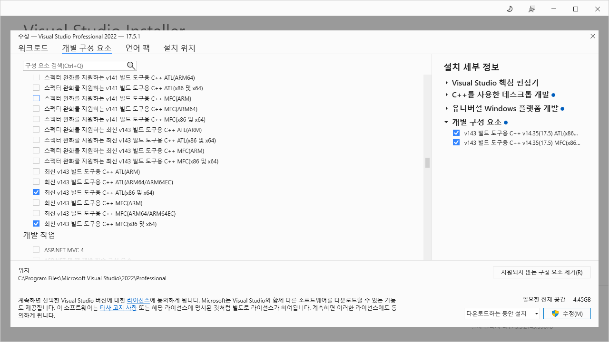

# 영상출력 및 영상산술연산 실습보고서

지능IOT융합전공 202115064 김동주

*상명대학교*

HAEM0018-1 멀티미디어신호처리

## 초록

### 요약

본 보고서에서는 2023-03-10에 멀티미디어신호처리 과목에서 실습한 내용을 다룬다. 개발환경 구축 및 두 가지의 프로젝트('Hello', 'ImagePro')를 구현하고 빌드하여 실행결과를 확인 하는 것으로 본 실습은 마무리 된다.

### 개발환경

Microsoft Foundation Classes(이하 MFC)는 Windows 운영체제에서 사용가능한 C++ GUI 라이브러리로 MacOS에서는 사용이 불가하다는 단점이 있다. 따라서 본 실습을 위해서 멀티미디어실(G517)의 로컬 컴퓨터와 개인용 컴퓨터를 사용하였다.

개발환경 1 (상명대학교 G517 로컬 컴퓨터):
- 운영체제: Microsoft Windows 10 Pro (x64)
- IDE: Visual Studio Professional 2015

개발환경 2 (개인용 컴퓨터):
- 운영체제: Microsoft Windows 10 Home (x64)
- IDE: Visual Studio Community 2022

## 본문

### 개발환경 구축

개발환경 구축은 IDE의 설치와 의존성 설치 및 프로젝트 구성으로 이루어진다.

#### Visual Studio 설치

Visual Studio는 https://visualstudio.microsoft.com/ko/ 에서 설치가 가능하다. Community 버전을 사용할 경우 무료로 설치가 가능하며, 라이센스가 있을 시에는 Professional 버전을 사용할 수 있다.

#### MFC 설치

본 실습을 위해서는 Microsoft Foundation Classes 라이브러리가 필요하다. 이는 Visual Studio의 설치가 모두 끝난 후, [도구] - [도구 및 기능 가져오기] 메뉴에서 '빌드 도구용 C++ MFC'를 선택하여 설치할 수 있다.



'C++ MFC' 항목이 나타나지 않는 경우에는 'Visual C++ ...'의 이름을 가진 항목에서 유사한 요소를 찾아 설치할 수 있었다.

#### 프로젝트 생성과 초기 설정

[새 프로젝트 만들기]를 열고, 'C++'언어의 'MFC 앱' 템플릿을 선택하여 MFC 프로젝트를 생성할 수 있다.

프로젝트를 생성한 후에 '문자 집합'을 비활성화 해주면 문자 인코딩으로 인해 발생하는 오류를 줄일 수 있다. [프로젝트] - [속성] - [구성속성/고급] 에서 '문자 집합'을 '설정 안 함'으로 변경하여 설정을 완료한다. 만약, `AfxMessageBox()` 함수와 관련하여 오류 메시지가 발생한다면, Visual Studio의 문자 처리 방식으로 인한 함수 시그니처 mismatch 오류일 수 있으므로 이 방법을 반드시 적용해 주는 것이 좋다.

#### Visual Studio의 Debugger 사용

중단점(Breakpoint) 기능을 사용할 수 있다. 중단점 설정 후 [디버그] - [디버깅 시작] 메뉴를 선택하여 디버깅을 시작할 수 있다. 임의의 중단점에서 변수의 주소 및 값을 조회할 수 있다.

메모리 상에서 raw 값을 조회하고 싶은 경우, 디버거를 통해 조회할 주소를 알아낸 후, 찾아낼 주소를 [보기] - [메모리 뷰]에 입력하여 탐색할 수 있다. 16진수가 2자리씩 하나의 Byte를 이루어 표시된다.

#### DIPSIM v2.0 사용

Visual Studio의 디버거와 메모리 뷰를 통해 화소의 픽셀 값을 조회할 수 있지만, 강의자료와 함께 배포된 DIPSIM 응용 프로그램을 사용하면 이미지와 관련된 다양한 기능을 직관적인 GUI를 통해 이용할 수 있다. 히스토그램이나 화솟값 처리 및 조회와 같은 다양한 기능이 있다.

#### 이미지 데이터셋 준비

강의자료와 함께 배부된 '이미지.zip'의 자료를 사용한다. *.raw 파일과 *.bmp, *.jpg, *.pmg 파일이 존재한다. *.raw 파일은 이미지에 대한 정보가 제공되지 않지만 *.bmp, *.jpg와 같은 이미지 형식은 이미지의 해상도 및 다양한 정보가 파일 헤더에 명시되어 있음에 유의한다.

### MFC 프로그래밍

본격적으로 영상처리 프로그래밍을 시작하기 전 MFC가 제공하는 인터페이스를 사용하여 GUI를 구현하는 방법에 대하여 알아보았다.

#### 윈도우 프로그램 작성

`C...View::OnDraw(CDC *pDC)` 함수 구현체를 수정하여 MFC 프로그램의 GUI에 문자를 출력하는 방법을 알아보았다.

```c
// GetDocument() 함수를 호출하여 CHelloDoc의 싱글턴 구조체를 가져온다.
CHelloDoc *pDoc = GetDocument();

...

// MFC Document 구조체의 TextOut() 함수를 이용하여 100, 100 좌표에 주어진 문자열을 출력한다.
pDC->TextOut(100, 100, "첫번째 영상처리");
```

#### 부메뉴 생성 및 연결 함수 작성

[보기]-[리소스 뷰]-[Hello]-[Hello.rc]-[Menu]-[IDR_HelloTYPE]를 열어 메뉴와 부메뉴를 생성하고 관리할 수 있다.

본 단계에서는 메뉴와 부메뉴를 생성하고, 부메뉴에 연결 함수를 작성해주는 것까지 진행하였다.

Visual Studio의 '이벤트 처리기 마법사'를 이용하여 'COMMAND' 메시지 형식의 함수 처리기를 'CHelloView' 클래스에 생성해준다. 클래스 뷰를 통해 새로 생성된 함수 처리기의 내부에 구현할 기능을 작성하면 된다.

간단한 다이얼로그를 출력하는 방법으로는 `AfxMessageBox(char*)` 함수를 사용하는 방법이 있다는 것을 알 수 있었다.

#### 영상 출력 프로그램 작성

기본 클래스로 'CScrollView'를 사용하는 'MFC 응용 프로그램' 프로젝트를 생성한 뒤, 2중 for-loop를 이용하여 MFC View 에 이미지를 출력하는 프로그램을 작성해보았다.

이미지를 읽고 처리하기 위해서는 영상을 저장할 기억공간이 필요하므로 다음과 같이 2차원 배열을 선언하여 사용하였다.

```c
unsigned char inputImg[256][256];
unsigned char resultImg[256][256];
```

이 중에서 읽은 이미지의 원본은 `inputImg`에 저장하고, 영상 처리된 결과를 `resultImg`에 담아 사용한다.

위와 같이 256x256배열을 선언하여 사용할 경우, 최대 가로x세로 폭이 256 이하인 영상밖에 사용할 수 없다는 한계가 있다. 또한, 각 x,y 좌표에 `unsigned char`의 표현 범위밖에 담을 수 없으므로, 한 픽셀 당 $[0, 255]$ 범위의 내의 값만 할당 할 수 있다. 본 실습에서는 Single-Channel(Gray-scale) 이미지를 사용할 것으로 추측해 볼 수 있었다.

### 픽셀 기반 영상처리 프로그래밍

#### 산술 덧셈 연산

#### 히스토그램 평활화

#### 두 영상의 산술 덧셈

## 결과

### 의의

본 실습을 통해 MFC 응용 프로그램의 개발환경을 구축하는 방법과 전반적인 프로젝트의 아키텍쳐를 알 수 있었다. 간단한 메뉴 구성을 추가할 수 있으며, 영상을 출력하는 방법에 대해 알아보았다. 더 나아가, 이미지의 화솟값에 대한 산술 연산을 하는 방법에 대해 알아보았다. 화솟값의 오버플로우 현상를 방지하기 위해 포화연산을 적용하는 방법 또한 알아보았다.

### 한계

본 실습에서 사용하는 이미지 데이터는 모두 256x256 크기로, 다른 크기의 이미지가 주어지면 프로그램이 정상적으로 동작하지 않을 수 있다는 단점이 있다.