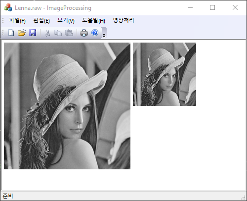
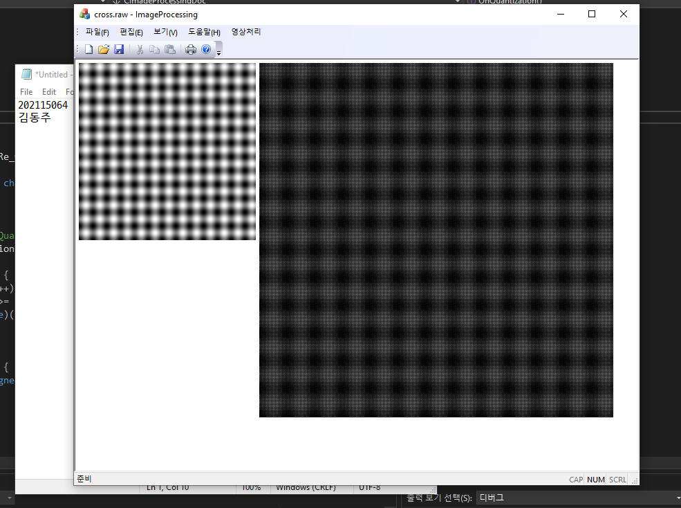
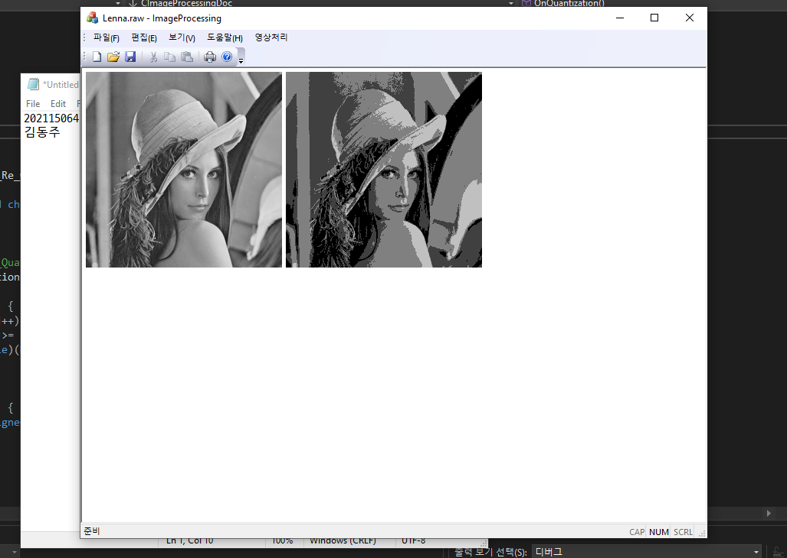

# 히스토그램 구현 실습 보고서 실습보고서

지능IOT융합전공 202115064 김동주

*상명대학교*

HAEM0018-1 멀티미디어신호처리

## 초록

### 요약

본 보고서에서는 2023-03-17에 멀티미디어신호처리 과목에서 실습한 내용을 다룬다. 본래의 목적은 강의자료 ch.4의 히스토그램까지 구현하는 것이었으나, 시간상의 한계로 ch.3 양자화 기능까지 구현하고 빌드하여 실행결과를 확인 하는 것으로 본 실습은 마무리 된다.

### 개발환경

Microsoft Foundation Classes(이하 MFC)는 Windows 운영체제에서 사용가능한 C++ GUI 라이브러리로 MacOS에서는 사용이 불가하다는 단점이 있다. 따라서 본 실습을 위해서 멀티미디어실(G517)의 로컬 컴퓨터와 개인용 컴퓨터를 사용하였다.

개발환경 1 (상명대학교 G517 로컬 컴퓨터):
- 운영체제: Microsoft Windows 10 Pro (x64)
- IDE: Visual Studio Professional 2015

개발환경 2 (개인용 컴퓨터):
- 운영체제: Microsoft Windows 10 Home (x64)
- IDE: Visual Studio Community 2022

## 본문

본 실습에서는 ‘ImageProcessing’ 프로젝트가 사용하였다. 해당 프로젝트는 강의자료 ‘Ch.3 영상처리를 위한 Visual C++’의 안내에 따라 생성된 ‘MFC 응용 프로그램’ 프로젝트이다.

### OnOpenDocument 함수를 이용한 파일 입력 프로그램

`OnOpenDocument()` 메소드를 오버라이드하여 [파일 열기] 동작 수행시, 이미지를 불러와 사용자 변수 `m_InputImage`에 삽입하는 동작을 수행하도록 내부 동작을 재정의하였다.

파일 헤더가 없는 *.raw 파일을 대상으로 수행할 것이므로, 정해진 가로, 세로의 길이를 가진 이미지만 입력 받을 수 있다. 따라서, 파일의 크기를 통해 픽셀의 개수를 세어 256x256, 512x512, 640x480 크기의 이미지로 추정될 때만 입력받고, 그 외의 경우에는 예외처리를 하였다.

```cpp
BOOL CImageProcessingDoc::OnOpenDocument(LPCTSTR lpszPathName)
{
	if (!CDocument::OnOpenDocument(lpszPathName)) {
		return FALSE;
	}

	CFile File;

	File.Open(lpszPathName, CFile::modeRead | CFile::typeBinary);

	switch (File.GetLength())
	{
	case 256 * 256:
		m_height = 256;
		m_width = 256;
		break;

	case 512 * 512:
		m_height = 512;
		m_width = 512;
		break;

	case 640 * 480:
		m_height = 480;
		m_width = 640;
		break;

	default:
		AfxMessageBox("Not Supported Image Size");
		return FALSE;
	}

	m_size = m_height * m_width;

	m_InputImage = new unsigned char[m_size];

	for (int i = 0; i < m_size; i++) {
		m_InputImage[i] = 255;
	}

	File.Read(m_InputImage, m_size);
	File.Close();

	return TRUE;
}
```

이 재정의 과정에서 많은 동기들이 함수의 시그니쳐 `BOOL OnOpenDocument(LPCTSTR)`과  `bool OnOpenDocument(LPCTSTR)`을 구분하지 못하여 오류를 겪는 것을 다수 보았다.

### OnSaveDocument 함수를 이용한 파일 출력 프로그램

앞선 과정과 유사한 방법으로 `OnSaveDocument()` 메소드를 오버라이드하여 [파일 저장] 동작 수행시, 다른 이름으로 이미지를 저장할 수 있도록 함수 동작을 재정의하였다. 기본적으로 확장명은 *.raw 를 사용하도록 다이얼로그 출력 함수 호출을 다음과 같이 구현하였다.

```cpp
CFileDialog SaveDlg(FALSE, "raw", NULL, OFN_HIDEREADONLY);
```

### 영상 축소 프로그램

[영상처리] 메뉴에 [DownSample] 부메뉴를 생성하고, 다음의 함수들을 이용한 이벤트처리기를 통해 영상 축소 동작을 구현하였다.

- `void CImageProcessingDoc::OnDownSampling()`
- `void CImageProcessingView::OnDownSampling()`



동작 원리는 다음과 같다:

1. 다이얼로그에 축소 비율(정수)을 입력한다.
2. 해당 비율만큼 원본 이미지의 화소를 건너뛰면서 영상을 출력한다.

```cpp
void CImageProcessingDoc::OnDownSampling()
{
	int y, x;
	CDownSampleDlg dlg;

	if (dlg.DoModal() == IDOK) {
		m_Re_height = m_height / dlg.m_DownSampleRate;
		m_Re_width = m_width / dlg.m_DownSampleRate;
		m_Re_size = m_Re_height * m_Re_width;

		m_OutputImage = new unsigned char[m_Re_size];

		for (y = 0; y < m_Re_height; y++) {
			for (x = 0; x < m_Re_width; x++) {
				m_OutputImage[y * m_Re_width + x] = m_InputImage[(y * dlg.m_DownSampleRate * m_width) + dlg.m_DownSampleRate * x];
			}
		}
	}
}
```

### 영상 확대 프로그램

[영상처리] 메뉴에 [UpSample] 부메뉴를 생성하고, 다음의 함수들을 이용한 이벤트처리기를 통해 영상 확대 동작을 구현하였다.

- `void CImageProcessingDoc::OnUpSampling()`
- `void CImageProcessingView::OnUpSampling()`

다음 이미지는 확대 비율을 2로 설정하여 결과를 출력한 것이다.



동작 원리는 다음과 같다:

1. 다이얼로그에 확대 비율(정수)을 입력한다.
2. 해당 비율만큼 출력할 화소의 위치를 건너뛰면서 영상을 출력한다.

```cpp
void CImageProcessingDoc::OnUpSampling()
{
	int i;
	int x, y;
	CUpSampleDlg dlg;

	if (dlg.DoModal() != IDOK) {
		return;
	}

	m_Re_height = m_height * dlg.m_UpSampleRate;
	m_Re_width = m_width * dlg.m_UpSampleRate;
	m_Re_size = m_Re_height * m_Re_width;

	m_OutputImage = new unsigned char[m_Re_size];

	for (i = 0; i < m_Re_size; i++) {
		m_OutputImage[i] = 0;
	}

	for (y = 0; y < m_height; y++) {
		for (x = 0; x < m_width; x++) {
			m_OutputImage[(y * m_Re_width + x) * dlg.m_UpSampleRate] = m_InputImage[y * m_width + x];
		}
	}
}
```

### 양자화 프로그램

[영상처리] 메뉴에 [양자화] 부메뉴를 생성하고, 다음의 함수들을 이용한 이벤트처리기를 통해 양자화 동작을 구현하였다.

- `void CImageProcessingDoc::OnQuantization()`
- `void CImageProcessingView::OnQuantization()`

다음 이미지는 lena.raw에 대하여 2비트 양자화를 수행한 결과이다.



동작원리는 다음과 같다.

1. 양자화 비트 수를 입력한다.
2. 입력한 비트 수의 2의 n승 개수로 밝기 구간을 나눈다.
3. 각 화소의 값을 가장 근사한 구간의 시작 점으로 floor 시킨다. (`float` -> `unsigned char`로의 type casting 이용)

하단의 코드는 강의자료의 코드와 동작이 일치하나, 일부 매직 변수들을 전처리 매크로를 통해 분리한 점만 다른 코드이다.

```cpp
#define LEVEL 256
#define HIGH 256

void CImageProcessingDoc::OnQuantization()
{
	CQuantizationDlg dlg;

	if (dlg.DoModal() != IDOK)
	{
		return;
	}

	int i, j, value;
	double * TEMP;

	m_Re_height = m_height;
	m_Re_width = m_width;
	m_Re_size = m_Re_height * m_Re_width;

	m_OutputImage = new unsigned char[m_Re_size];

	TEMP = new double[m_size];

	//value = (int)pow(2, dlg.m_QuantizationBit);
	value = 1 << dlg.m_QuantizationBit;

	for (i = 0; i < m_size; i++) {
		for (j = 0; j < value; j++) {
			if (m_InputImage[i] >= (LEVEL / value) * j && m_InputImage[i] < (LEVEL / value) * (j + 1)) {
				TEMP[i] = (double)(HIGH / value) * j;
			}
		}
	}
	for (i = 0; i < m_size; i++) {
		m_OutputImage[i] = (unsigned char)TEMP[i];
	}
}
```

## 결과

### 의의

본 실습을 통해 간단한 파일 출력 방법은 물론, 화소점 처리를 이용한 연산처리가 어떻게 이루어지는지를 알아볼 수 있었다.

Down Sampling 비율을 설정해, 일부 화소의 출력을 생략하면서 이미지를 축소시킬 수 있고, Up Sampling 비율을 설정하여 각 화소 사이에 공간을 두어 이미지를 확대 시킬 수 있었다. 또한, 양자화 비트 수 $n$을 설정하여 $2^n$가지의 밝기를 가진 이미지로 양자화 시키는 동작을 실습해보았다.

### 한계

Down Sampling과 Up Sampling, 그리고 Quantization은 이미지에 대하여 큰 손실을 야기한다고 느껴졌다. 축소 과정에서 일부 픽셀을 생략하거나, 양자화 과정을 수행하면서 이미지의 세부 정보가 누락되기도 하고, 확대 과정에서 이미지가 어두워지는 것 같이 보이기도 한다.

양자화는 특별한 개선 방안이 떠오르지는 않았으나, 축소/확대 연산은 축소 알고리즘으로 특정 화소 영역에서 평균값을 취한다거나, 확대 과정에서 빈 공간을 채우는 보간 알고리즘을 고안해 보는 것으로서 조금 더 사용자에게 친숙한 결과를 보일 수 있을 것으로 기대된다.

## 비고

### 실습 중 발생한 리소스 뷰 오류

#### 오류가 발생하는 순간

실습을 진행하던 중에 맞닥뜨린 문제 중 가장 치명적이었던 것은 [리소스 뷰]를 이용한 다이얼로그 GUI를 수정할 수 없다는 것이었다.

해당 문제는 Visual Studio 2022 Professional 에서 MFC 응용 프로그램의 [리소스 뷰] - [프로젝트명.rc] - [Dialog] 항목을 이용할 때 발생한다.

다음 그림과 같이 [Menu] 항목에 대해서는 GUI 편집기가 정상적으로 동작한다.


그러나, [Dialog]의 항목 중 하나를 이중 클릭하여 편집기 열기를 시도하면 Visual Studio 프로그램 전체가 응답하지 않으며, 작업관리자를 통해 프로세스 종료를 하지 않는 이상은 사용자가 Visual Studio를 종료할 수 없다.

해당 문제를 파악하고, Visual Studio Developer Community에 제보하였으나, 엔지니어링 팀에서는 해당 문제의 원인을 아직 파악하지 못한 상태이다.

https://developercommunity.visualstudio.com/t/Unable-to-edit-MFC-dialogs/10308847

#### 대처 방안

실습을 위해서는 GUI 구현을 필요로 했으므로 다이얼로그 생성 과정을 생략할 수 없어, G517 실습실에서 수행했던 'UpSampling 구현' 내용의 Git 변경사항을 추적해, 파일을 직접 수정하여 다이얼로그를 추가할 수 있었다.

참조한 커밋은 다음과 같으며, 해당 커밋을 모방하여 .rc 파일과 일부 헤더 파일을 추가/수정하여 [리소스 뷰] 없이도 겨우 다이얼로그를 생성할 수 있었다.

https://github.com/Hepheir/smu-HAEM0018-Multimedia-Signal-Processing/commit/69cdcc095a1b2f92bbac985ecc0bef6cff6935cd
